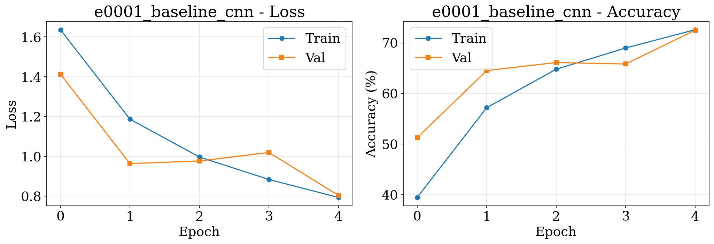
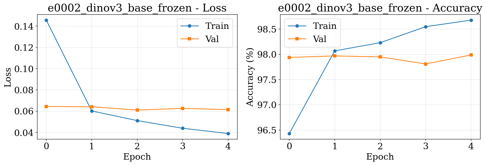
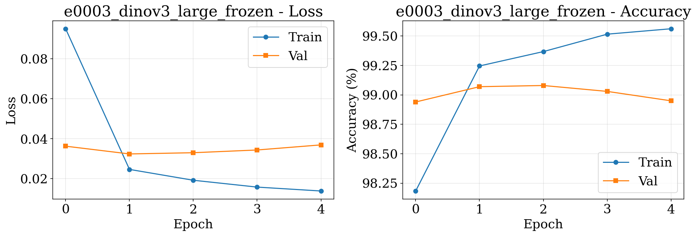
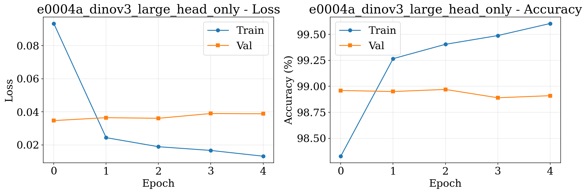
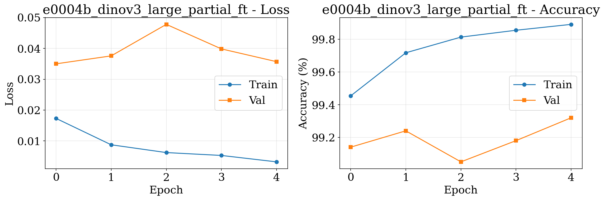

# CIFAR-10 Classification Experiments Report

|          |          |
|----------|----------|
|Start Date|YYYY-MM-DD|
|End Date  |YYYY-MM-DD|
|Dataset   |CIFAR-10|
|Author    |Mykhailo Pavliuk|

## Motivation

Conduct systematic experiments on CIFAR-10 to compare:
1. Baseline CNN trained from scratch
2. Transfer learning with DINOv3-base (frozen features)
3. Transfer learning with DINOv3-large (frozen features)
4. Fine-tuning strategies with DINOv3-large:
   - Head-only training
   - Partial unfreezing (last 4 layers)
   - Full fine-tuning

The goal is to understand the trade-offs between model complexity, training time, and accuracy, and to determine the most effective approach for CIFAR-10 classification.

---

# [e0001] Baseline CNN

|          |          |
|----------|----------|
|Start Date|YYYY-MM-DD|
|End Date  |YYYY-MM-DD|
|Dataset   |CIFAR-10|
|New       |yes|

## Architecture

Simple CNN with 3 convolutional blocks:
- Block 1: 2x Conv(64) + MaxPool
- Block 2: 2x Conv(128) + MaxPool  
- Block 3: 2x Conv(256) + MaxPool
- FC layers: 4096 → 512 → 10

All conv layers use 3x3 kernels, padding=1, with BatchNorm and ReLU.
Dropout (0.5) applied in classifier.

## Hyperparameters

```
Batch size: 128
Epochs: 50
Learning rate: 0.001
Optimizer: Adam
Data augmentation: RandomCrop(32, padding=4), RandomHorizontalFlip
```

## Results & Deliverables

**Training time**: ___ minutes (___s per epoch)
**Best validation accuracy**: __.___%
**Final train accuracy**: __.___%
**Total parameters**: ___,___
**Trainable parameters**: ___,___

## Training Curves



## Interpretation & Conclusion

[FILL IN AFTER RUNNING]
- How quickly did the model converge?
- Signs of overfitting?
- Comparison expectations with transfer learning approaches

---

# [e0002] DINOv3-base (Frozen Features)

|          |          |
|----------|----------|
|Start Date|YYYY-MM-DD|
|End Date  |YYYY-MM-DD|
|Dataset   |CIFAR-10|
|Continues |e0001|

## Architecture

- **Backbone**: DINOv3-base (ViT-B/16) - FROZEN
  - Pretrained on LVD-1689M dataset
  - Input size: 224×224 (CIFAR-10 upsampled from 32×32)
- **Classifier**: 
  - Linear(768 → 512) + ReLU + Dropout(0.3)
  - Linear(512 → 10)

## Hyperparameters

```
Batch size: 64 (reduced due to 224×224 inputs)
Epochs: 20
Learning rate: 0.001
Optimizer: Adam
Preprocessing: Resize to 224, ImageNet normalization
```

## Results & Deliverables

**Training time**: ___ minutes (___s per epoch)
**Best validation accuracy**: __.___%
**Final train accuracy**: __.___%
**Total parameters**: ___,___ (___,___ trainable)

## Training Curves



## Interpretation & Conclusion

[FILL IN AFTER RUNNING]
- Comparison with baseline CNN
- Impact of frozen features vs training from scratch
- Does pretrained DINOv3 knowledge transfer to CIFAR-10?

---

# [e0003] DINOv3-large (Frozen Features)

|          |          |
|----------|----------|
|Start Date|YYYY-MM-DD|
|End Date  |YYYY-MM-DD|
|Dataset   |CIFAR-10|
|Continues |e0002|

## Architecture

- **Backbone**: DINOv3-large (ViT-L/16) - FROZEN
  - Larger model than base
  - Input size: 224×224
- **Classifier**: Same as e0002
  - Linear(1024 → 512) + ReLU + Dropout(0.3)
  - Linear(512 → 10)

## Hyperparameters

```
Batch size: 64
Epochs: 20
Learning rate: 0.001
Optimizer: Adam
```

## Results & Deliverables

**Training time**: ___ minutes (___s per epoch)
**Best validation accuracy**: __.___%
**Final train accuracy**: __.___%
**Total parameters**: ___,___ (___,___ trainable)

## Training Curves



## Interpretation & Conclusion

[FILL IN AFTER RUNNING]
- Does larger model improve accuracy?
- Training time comparison with DINOv3-base
- Is the improvement worth the computational cost?

---

# [e0004a-c] DINOv3-large Fine-tuning

|          |          |
|----------|----------|
|Start Date|YYYY-MM-DD|
|End Date  |YYYY-MM-DD|
|Dataset   |CIFAR-10|
|Continues |e0003|

## Experiments Overview

Three fine-tuning strategies:
- **e0004a**: Train classifier head only (warmup)
- **e0004b**: Unfreeze last 4 transformer layers
- **e0004c**: Full model fine-tuning

---

## [e0004a] Head-Only Fine-tuning

### Configuration
```
Backbone: FROZEN
Classifier: TRAINABLE
Epochs: 15
Learning rate: 0.001
```

### Results
**Best validation accuracy**: __.___%
**Training time**: ___ minutes



---

## [e0004b] Partial Fine-tuning (Last 4 Layers)

### Configuration
```
Backbone: Last 4 layers UNFROZEN
Classifier: TRAINABLE
Epochs: 15
Learning rate: 0.0001 (reduced for stability)
Starting from: e0004a checkpoint
```

### Results
**Best validation accuracy**: __.___%
**Training time**: ___ minutes



---

## [e0004c] Full Fine-tuning

### Configuration
```
Backbone: FULLY UNFROZEN
Classifier: TRAINABLE
Epochs: 10
Learning rate: 0.00001 (very low to prevent catastrophic forgetting)
Starting from: Fresh model
```

### Results
**Best validation accuracy**: __.___%
**Training time**: ___ minutes


---

## Fine-tuning Strategy Comparison

| Experiment |     Strategy    | Val Acc | Training Time | Trainable Params |
|------------|-----------------|---------|---------------|------------------|
| e0004a     | Head only       | __.__% | ___ min       | ___,___         |
| e0004b     | Last 4 layers   | __.__% | ___ min       | ___,___         |
| e0004c     | Full model      | __.__% | ___ min       | ___,___         |

## Interpretation & Conclusion

[FILL IN AFTER RUNNING]
- Which strategy achieved best accuracy?
- Trade-off between accuracy and training time
- Signs of overfitting in full fine-tuning?
- Optimal learning rate for each strategy

---

# Overall Comparison

## Summary Table

| Experiment | Description | Val Acc | Train Time | Total Params | Trainable Params |
|------------|-------------|---------|------------|--------------|------------------|
| e0001      | Baseline CNN | __.__% | ___ min   | ___,___     | ___,___         |
| e0002      | DINOv3-base (frozen) | __.__% | ___ min | ___,___ | ___,___ |
| e0003      | DINOv3-large (frozen) | __.__% | ___ min | ___,___ | ___,___ |
| e0004a     | DINOv3-large (head) | __.__% | ___ min | ___,___ | ___,___ |
| e0004b     | DINOv3-large (partial) | __.__% | ___ min | ___,___ | ___,___ |
| e0004c     | DINOv3-large (full) | __.__% | ___ min | ___,___ | ___,___ |

## Comparison Charts


## Key Findings

[FILL IN AFTER RUNNING]

### Best Overall Model
**Winner**: _______
**Accuracy**: __.___%
**Justification**: _______

### Efficiency vs Accuracy
- Most efficient (accuracy/time): _______
- Best accuracy regardless of cost: _______
- Best for production deployment: _______

### Transfer Learning Insights
- Baseline CNN performance: __.___%
- Best frozen features model: _______
- Improvement from fine-tuning: +___._%

### Recommendations
1. For quick prototyping: _______
2. For best accuracy: _______
3. For production deployment: _______

## Observations

### Training Dynamics
[FILL IN]
- Convergence speed comparison
- Overfitting patterns
- Impact of learning rate

### Architecture Insights
[FILL IN]
- CNN vs Transformer features
- Small vs large pretrained models
- Frozen vs fine-tuned approaches

### Dataset Considerations
[FILL IN]
- Impact of upsampling 32×32 → 224×224
- Does CIFAR-10 benefit from ImageNet pretraining?
- Are 224×224 inputs necessary or overkill?

## Conclusions

[FILL IN AFTER RUNNING]

**Main takeaways**:
1. _______
2. _______
3. _______

**Future work**:
- Try DINOv3-small for faster training
- Experiment with different input sizes
- Test on other datasets (DTD, etc.)
- Implement progressive unfreezing strategy
- Try different augmentation strategies

---

## Appendix: Experimental Details

### System Configuration
- GPU: _______
- CUDA version: _______
- PyTorch version: _______
- Transformers version: _______

### Data Preprocessing
**Training transforms**:
- RandomCrop(32, padding=4) [for CNN]
- Resize(224) + RandomCrop(224, padding=28) [for DINOv3]
- RandomHorizontalFlip
- Normalization (dataset-specific)

**Test transforms**:
- Resize(224) [for DINOv3]
- Normalization only

### Reproducibility
- Random seed: 42
- PyTorch deterministic: True
- Code version: _______
- Experiment tracking: JSON files + plots

---

**Report generated**: YYYY-MM-DD
**Total experiments**: 6
**Total training time**: ___ hours
